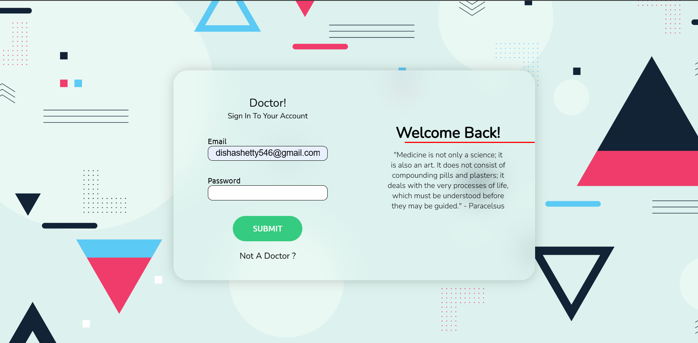
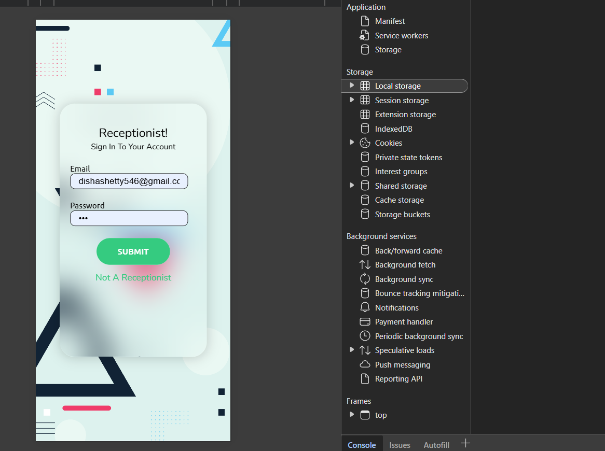

# 🏥 MediBridge — Patient Record & Clinic Management System


**MediBridge** is a full-stack web application designed to modernize patient record handling in clinics. It bridges the gap between doctors, patients, and receptionists through a centralized, easy-to-use digital platform.

---



## ❗ Problem Statement

Traditional patient recordkeeping in clinics often leads to:

- Long wait times for registration and checkups
- Misplaced or inaccessible patient history
- Inefficient coordination between doctors and receptionists
- No quick way to retrieve records using phone number or token

> 🔍 There is a need for a lightweight, secure, and digitized platform to streamline patient registration, medical history access, and billing operations in real-time.

---

## 🎯 Key Use Cases

This application is ideal for small to mid-sized clinics. It enables:

- 🧾 Patient registration with **auto-generated token IDs**
- 🩺 Doctors to access real-time medical history and prescriptions
- 💰 Receptionists to manage billing and invoices efficiently
- 🔍 Patient retrieval via **phone number or token ID**
- 🧑‍⚕️ Multiple roles: Receptionist, Doctor, and Admin

---

## 💻 Tech Stack

| Category      | Technology     | Description                             |
| ------------- | -------------- | --------------------------------------- |
| **Frontend**  | React.js       | Interactive user interfaces             |
|               | Axios          | API communication                       |
|               | React Router   | Client-side routing                     |
|               | Tailwind CSS   | Fast, responsive, utility-first styling |
| **Backend**   | Node.js        | Runtime environment                     |
|               | Express.js     | Web server framework                    |
|               | MongoDB        | NoSQL database for patient data         |
|               | Mongoose       | MongoDB object modeling (ODM)           |
|               | JSON Web Token | Role-based authentication & security    |
|               | bcryptjs       | Password hashing                        |
| **Dev Tools** | Nodemon        | Auto-restarts server on changes         |
|               | dotenv         | Manage environment variables            |
| **Database**  | MongoDB Atlas  | Cloud-based database                    |

---

## 📸 Screenshots

| Reception Dashboard                       | Patient Profile                       | Doctor Dashboard                    |
| ----------------------------------------- | ------------------------------------- | ----------------------------------- |
|  |  |  |

---

### 📥 Installation

```bash
# Clone the repository
git clone https://github.com/Dishashetty546/MediBridge.git

```

## ⚙️ Installation & Setup

Follow these steps to get the project up and running on your local machine.

---

### 1. Install Frontend , Backend Dependencies and Configure MongoDB

`````bash
cd client
npm install

````bash
cd server
npm install

````bash
server/db.js
`````

## 🧾 Usage Workflow

Below is a step-by-step guide to using the **MediBridge** system. Each action is accompanied by a relevant screenshot for clarity.

---

### 1. 🧑‍💼 Receptionist Login

- Login to the receptionist panel using the credentials:
  - **Email:** `receptionist@careclinic.com`
  - **Password:** `receptionist@careclinic.com`
- Navigate to the **Patient Registration** section.

📸 Screenshot:  


---

### 2. 🆕 Generate Token

- Register new patients by entering their details (name, age, phone, etc.).
- A **unique token ID** is generated upon registration.
- Provide this token to the patient for future consultations.

📸 Screenshot:  


---

### 3. 🩺 Doctor Login

- Login to the doctor's panel using:
  - **Email:** `doctor@careclinic.com`
  - **Password:** `doctor@careclinic.com`

📸 Screenshot:  


---

### 4. 🔍 Retrieve Patient Information

- Enter the **patient's token ID** to access:
  - Patient details
  - Medical history
  - Previous prescriptions

📸 Screenshot:  


---

### 5. 💊 Prescription Details

- Consult with the patient.
- Add a **new prescription** with:
  - Medications
  - Recommended treatments
  - Notes or diagnosis

📸 Screenshot:  


---

### 6. 💳 Receptionist Billing

- Login as a receptionist again.
- Retrieve patient data using the token.
- Review doctor's prescription.
- Enter and confirm **billing details**:
  - Consultation fee
  - Medicine costs

📸 Screenshot:  


---
